# 🧠 DocuMind AI — Multi-User Enterprise RAG Platform

A production-grade, multi-tenant Retrieval-Augmented Generation (RAG) system built with **Streamlit**, **FastAPI**, **Pinecone Vector Database**, **Groq LLMs**, **SentenceTransformers**, and **SQLAlchemy**.

Features secure user isolation, mandatory email OTP verification, Bring-Your-Own-Key (BYOK) tiering, encrypted credential vaults, in-app document downloads, OCR processing for scanned PDFs, and real-time administrator analytics.

---

## 🌟 Key Features & Capabilities

- 🔐 **Multi-User Workspace & Vector Isolation**: Each user operates in a strictly isolated vector workspace using dynamic Pinecone namespaces (`user_<id>`), ensuring zero cross-tenant data leakage.
- ✉️ **Staged Email OTP Verification**: 
  - 2-step registration with 10-minute 6-digit OTP codes delivered via SMTP.
  - Zero unverified account clutter (staged in a separate pending table until verified).
  - Code invalidation on resend and brute-force attempt limits.
- 🔑 **Hybrid Credential Engine & BYOK Tiering**:
  - **Shared Mode**: Free tier users can index up to 2 documents on application credentials.
  - **BYOK Mode**: Power users can input their own Pinecone & Groq API keys for unlimited document processing.
  - **AES-256 Encryption**: User API keys are symmetrically encrypted at rest using Fernet encryption.
- 📑 **Comprehensive PDF Ingestion & OCR**:
  - Automatic searchable vs. non-searchable PDF detection.
  - Built-in OCR preprocessing via `OCRmyPDF` for image-based PDFs.
  - In-app **📥 Download** option for uploaded documents.
- 💬 **Streaming Chat & Citation Grounding**:
  - Real-time token streaming with Groq (`openai/gpt-oss-120b`).
  - Grounded answers with exact chunk similarity scores and source PDF citations.
  - Pinned non-shifting chat input layout.
- 🛡️ **Enterprise Admin Dashboard**:
  - Real-time KPI cards (Total Users, Active Sessions, Shared vs. BYOK distribution, Vector counts).
  - User management table with search, role toggle, and **100% cascade purge** (removes disk files, Pinecone vectors, and all database records).
  - Dynamic SMTP email settings with instant **📤 Send Test Email** tool.
  - Live security audit trail for all authentication and document events.
- ⚡ **Optimized Startup**: Lazy-loaded tokenizers and sentence-transformer embeddings enable cold startup in **~2 seconds**.

---

## 🏗️ Architecture Diagram

```mermaid
flowchart TD
    subgraph Auth [Authentication & Verification]
        User[User Registration] --> Staged[Pending Registration Table]
        Staged --> Email[SMTP Email with 10-min OTP]
        Email --> Verify[Dedicated Verification Screen]
        Verify --> ActiveUser[(Active Users DB)]
    end

    subgraph Ingestion [Document Ingestion Pipeline]
        PDF[Uploaded PDF] --> Check{Searchable?}
        Check -- No --> OCR[OCRmyPDF Engine]
        Check -- Yes --> Extract[PyMuPDF Text Extractor]
        OCR --> Extract
        Extract --> Splitter[Recursive Character Text Splitter]
        Splitter --> Embeddings[all-MiniLM-L6-v2 Model]
        Embeddings --> Pinecone[(Pinecone Namespace: user_id)]
    end

    subgraph Retrieval [Streaming RAG QA Pipeline]
        Query[User Question] --> QEmbed[Embed Query]
        QEmbed --> SimSearch[Pinecone Top-K Semantic Search]
        SimSearch --> Context[Context Assembly & Citations]
        Context --> Groq[Groq LLM: gpt-oss-120b]
        Groq --> Stream[Real-Time Token Streaming UI]
    end
```



---

## ⚙️ Prerequisites & Setup

### 1. Clone Repository & Activate Virtual Environment
```bash
# Windows PowerShell:
.\chat_bot\Scripts\Activate.ps1
```

### 2. Install Dependencies
```bash
pip install -r requirements.txt
```

### 3. Configure Environment Variables (`.env`)
Create a `.env` file in the root directory:
```env
# Application Secrets
SECRET_KEY=documind_production_secret_key_change_in_prod
ENCRYPTION_KEY=your_generated_fernet_256_bit_key

# Pinecone Shared Application Credentials
PINECONE_API_KEY=your_pinecone_api_key
PINECONE_INDEX_NAME=pdf-rag1-index
PINECONE_ENVIRONMENT=us-east-1
PINECONE_CLOUD=aws

# Groq LLM Configuration
GROQ_API_KEY=your_groq_api_key
GROQ_MODEL=openai/gpt-oss-120b
GROQ_TEMPERATURE=0.0

# SMTP Email Configuration (Optional - Can also be set in Admin Dashboard)
SMTP_HOST=smtp.gmail.com
SMTP_PORT=587
SMTP_USER=your_email@gmail.com
SMTP_PASSWORD=your_google_app_password
SMTP_FROM_EMAIL=no-reply@documind.ai
SMTP_FROM_NAME="DocuMind AI"
SMTP_USE_TLS=true
```

---

## 🚀 Running the Application

### 1. Launch the Streamlit Web Application
```bash
streamlit run streamlit_app.py
```
Open your browser at **`http://localhost:8501`**.

- **Default Administrator Credentials**:
  - **Email:** `admin@documind.ai`
  - **Password:** `Admin@123456`

### 2. (Optional) Run the FastAPI REST Server
```bash
python run.py
```
- Swagger API Docs: **`http://localhost:8000/docs`**
- Health Check: **`http://localhost:8000/health`**

---

## 🧪 Running Backend Verification Suite

A full automated test suite is provided in `scripts/test_backend.py` covering all 7 subsystems:
```bash
python scripts/test_backend.py
```

**Test Coverage:**
1. ✅ Database initialization & admin seeding
2. ✅ Strict RFC email validation, staged registration, OTP generation & resend invalidation
3. ✅ AES-256 symmetric credential encryption/decryption
4. ✅ Hybrid credential routing & vector namespace resolution
5. ✅ Free document quota enforcement (2 document limit)
6. ✅ BYOK mode upgrade & quota bypass
7. ✅ Admin analytics aggregation & audit logging

---

## 📁 Project Directory Structure

```text
Chat_Bot/
├── streamlit_app.py               # Streamlit application entrypoint
├── run.py                         # FastAPI server launcher
├── requirements.txt               # Project dependencies
├── .env                           # Environment secrets (ignored in git)
├── .gitignore                     # Git ignore rules
│
├── app/
│   ├── config.py                  # Pydantic v2 application settings
│   ├── main.py                    # FastAPI application setup
│   ├── db/
│   │   ├── database.py            # SQLAlchemy engine, session maker & init
│   │   ├── models.py              # User, Credential, Document, Chat, Audit models
│   │   └── crud.py                # Database transactions & helper queries
│   ├── services/
│   │   ├── auth_service.py        # Authentication, bcrypt, OTP & cascade purge
│   │   ├── email_service.py       # SMTP email delivery with dynamic DB loading
│   │   ├── credential_service.py  # BYOK validation & AES-256 key encryption
│   │   ├── crypto_service.py      # Fernet symmetric encryption helper
│   │   ├── document_service.py    # PDF searchability inspection & OCR pipeline
│   │   ├── chunking_service.py    # Lazy-loaded recursive character text splitter
│   │   ├── embedding_service.py   # SentenceTransformers embedding engine
│   │   ├── vector_service.py      # Pinecone namespace indexer & similarity search
│   │   ├── llm_service.py         # Groq LLM streaming QA client
│   │   ├── audit_service.py       # Security audit event logging
│   │   └── rag_service.py         # End-to-end RAG pipeline orchestrator
│   └── utils/
│       └── logger.py              # Colorized logger
│
├── components/
│   ├── auth_ui.py                 # Login, Register & Dedicated OTP verification
│   ├── header_ui.py               # Top bar navigation & user status
│   ├── documents_tab.py           # Document upload, downloads & index management
│   ├── chatbot_tab.py             # Chat interface with streaming & citations
│   ├── settings_tab.py            # BYOK credential manager
│   ├── usage_tab.py               # User quota & storage analytics
│   └── admin_dashboard.py         # Admin KPIs, user controls, SMTP setup & logs
│
├── data/                          # User-isolated document storage & SQLite database
└── scripts/
    └── test_backend.py            # Complete 7-part automated test suite
```

---

## 🔒 Security Best Practices

1. **Password Security:** Salted bcrypt hashing with strict complexity rules (minimum 8 characters, uppercase, lowercase, numbers).
2. **Zero Plaintext Secrets:** User BYOK Pinecone and Groq keys are encrypted using Fernet symmetric encryption with environment-level master keys.
3. **Tenant Vector Isolation:** Dynamic Pinecone namespaces ensure documents and embeddings belonging to User A cannot be retrieved or accessed by User B.
4. **Complete Cascade Purge:** Deleting a user purges all database records across 8 tables, clears their local storage folder, and deletes their Pinecone vector namespace.