# RAG Document Chatbot API

A high-performance, modular Retrieval-Augmented Generation (RAG) backend application built with **FastAPI**, **Pinecone Vector Database**, **SentenceTransformers**, and **Groq LLMs**.

---

## 🌟 Architecture Overview

```mermaid
flowchart TD
    subgraph Ingestion [Document Ingestion Pipeline]
        PDF[PDF Document] --> Check{Searchable?}
        Check -- No --> OCR[OCRmyPDF]
        Check -- Yes --> OpenDL[OpenDataLoader Extraction]
        OCR --> OpenDL
        OpenDL --> Splitter[Recursive Character Text Splitter]
        Splitter --> Embeddings[all-MiniLM-L6-v2 Embeddings]
        Embeddings --> PineconeDB[(Pinecone Vector DB)]
    end

    subgraph Retrieval [Query & QA Pipeline]
        User[User Question] --> API[FastAPI /api/v1/chat]
        API --> QueryEmbed[Embed Question]
        QueryEmbed --> PineconeSearch[Pinecone Top-K Search]
        PineconeSearch --> ContextAssembly[Context Builder]
        ContextAssembly --> GroqLLM[Groq LLM Engine]
        GroqLLM --> FinalResponse[Grounded Answer + Citations]
    end
```



---

## ⚙️ Prerequisites & Environment Setup

1. **Python Virtual Environment**:
   Ensure your Python virtual environment is activated:
   ```bash
   # Windows PowerShell:
   .\chat_bot\Scripts\Activate.ps1
   ```

2. **Install Dependencies**:
   ```bash
   pip install -r requirements.txt
   ```

3. **Configure Environment Variables (`.env`)**:
   Create or verify your `.env` file in the root directory:
   ```env
   PINECONE_API_KEY=your_pinecone_api_key
   PINECONE_INDEX_NAME=pdf-rag1-index
   PINECONE_ENVIRONMENT=us-east-1
   PINECONE_NAMESPACE=documents

   GROQ_API_KEY=your_groq_api_key
   GROQ_MODEL=openai/gpt-oss-120b
   GROQ_TEMPERATURE=0.0

   EMBEDDING_MODEL_NAME=sentence-transformers/all-MiniLM-L6-v2
   EMBEDDING_DIMENSION=384
   CHUNK_SIZE=1000
   CHUNK_OVERLAP=150
   TOP_K=5
   ```

---

## 🚀 Running the Application

### 1. Start the FastAPI Server
```bash
python run.py
```
- The interactive Swagger API documentation will be available at: **http://localhost:8000/docs**
- Health check: **http://localhost:8000/health**

### 2. Ingesting Documents via CLI
You can ingest documents into Pinecone using the CLI tool:
```bash
# Ingest single file
python scripts/ingest.py --file data/documents/Medical_book.pdf

# Ingest all files in a folder
python scripts/ingest.py --dir data/documents/
```

---

## 📡 API Endpoints

### 1. Chat & Query (`/api/v1/chat`)
- **`POST /api/v1/chat`**
  ```json
  {
    "question": "What is the definition of Antiparkinson drugs?",
    "top_k": 5,
    "namespace": "documents"
  }
  ```
  **Response**:
  ```json
  {
    "question": "What is the definition of Antiparkinson drugs?",
    "answer": "Antiparkinson drugs are medications used to treat Parkinson's disease...",
    "sources": [
      {
        "id": "Medical_book_chunk_12",
        "score": 0.854,
        "text": "...",
        "source": "Medical_book.pdf"
      }
    ],
    "response_time_ms": 782.45
  }
  ```

### 2. Document Ingestion (`/api/v1/documents`)
- **`POST /api/v1/documents/upload`** (Multipart File Upload)
- **`POST /api/v1/documents/ingest-local`** (Trigger local file ingestion)
- **`GET /api/v1/documents/stats`** (Get Pinecone vector count and namespace information)

---

## 📁 Project Directory Structure

```
Chat_Bot/
├── .env                          # API keys and environment variables
├── requirements.txt              # Project dependencies
├── run.py                        # Server launcher
├── scripts/
│   └── ingest.py                 # CLI document ingestion tool
├── data/
│   ├── documents/                # Input PDF documents
│   └── processed/                # OCR-processed PDFs
├── output/                       # Extracted text artifacts
└── app/
    ├── config.py                 # Pydantic v2 configuration
    ├── main.py                   # FastAPI initialization & routers
    ├── api/
    │   └── routes/
    │       ├── chat.py           # Chat API routes
    │       └── documents.py      # Ingestion API routes
    ├── schemas/
    │   ├── chat.py               # Request/Response schemas for chat
    │   └── document.py           # Request/Response schemas for documents
    ├── services/
    │   ├── document_service.py   # PDF text extraction & OCR
    │   ├── chunking_service.py   # LangChain text splitter
    │   ├── embedding_service.py  # SentenceTransformers embedding model
    │   ├── vector_service.py     # Pinecone vector operations
    │   ├── llm_service.py        # Groq client & strict prompt QA
    │   └── rag_service.py        # RAG pipeline orchestrator
    └── utils/
        └── logger.py             # Colorized logging utility
```